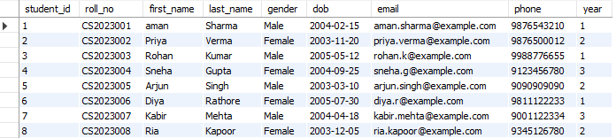
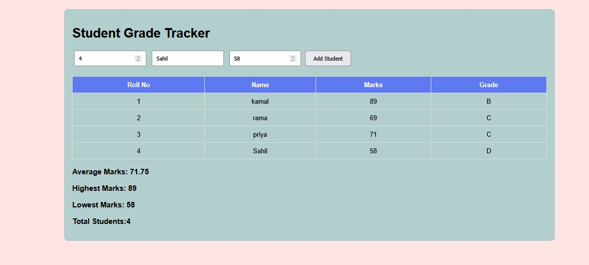

# 🎓 Student Grade Tracker

## 📌 Project Overview

Student Grade Tracker is a Java-based application developed to manage student records and analyze academic performance. The system allows users to add student details, calculate grades, determine average marks, and identify the highest and lowest scores.

This project was developed as part of the CodeAlpha Java Programming Internship.

---

## 🚀 Features

* Add student records
* Store roll number, name, and marks
* Calculate average marks
* Find highest marks
* Find lowest marks
* Generate grades automatically
* Display all student records
* User-friendly interface

---

## 🛠️ Technologies Used

* Java
* Object-Oriented Programming (OOP)
* HTML
* CSS
* JavaScript

---

## Project Structure

StudentGradesTracker
├── screenshots
├── src
├── frontend
└── README.md

## Screenshots

### Home Screen

### Student Records

### Statistics

---

## 🎯 Grade Criteria

| Marks    | Grade |
| -------- | ----- |
| 90 - 100 | A     |
| 75 - 89  | B     |
| 60 - 74  | C     |
| 40 - 59  | D     |
| Below 40 | F     |

---

## 📊 Functionalities

1. Add Student Details
2. Calculate Average Marks
3. Find Highest Score
4. Find Lowest Score
5. Assign Grades
6. Display Student Records

---

## 📸 Output Preview

Example:

Roll No: 101

Name: Sneha

Marks: 92

Grade: A

Average Marks: 78.33

Highest Marks: 92

Lowest Marks: 65

---

## 🎓 Learning Outcomes

Through this project, I gained practical experience in:

* Java Programming
* Object-Oriented Programming
* Data Management
* Problem Solving
* Frontend Development
* Project Documentation

---

## 👩‍💻 Author

Sneha

CodeAlpha Java Programming Internship

---

## ⭐ Future Enhancements

* Search Student by Roll Number
* Edit Student Records
* Delete Student Records
* Export Reports
* Database Integration
* Login Authentication System
